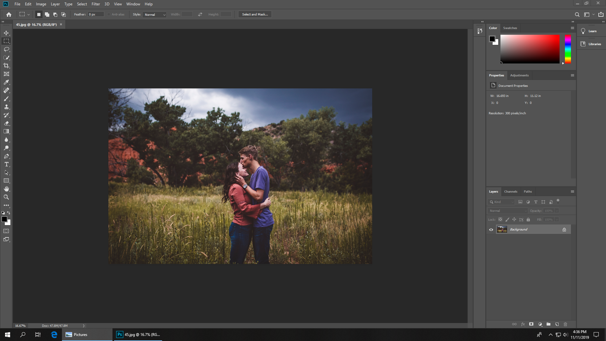
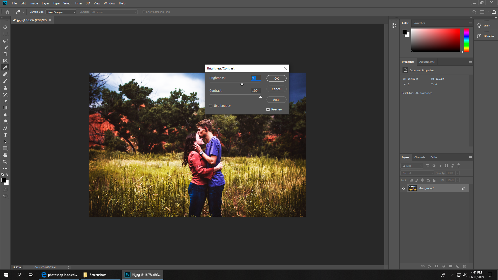
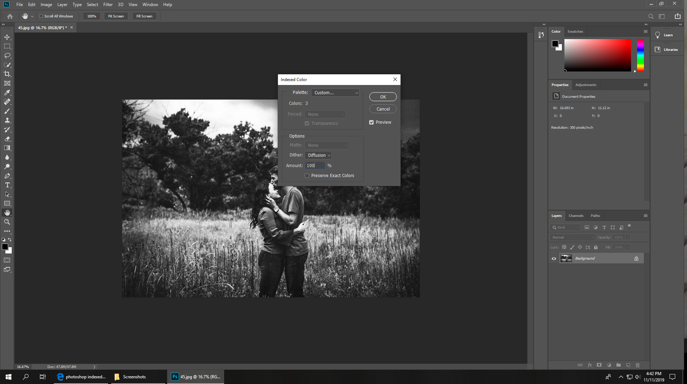

Preparing Images for running on the Laser Engraver
======

This is a guide for taking a picture in full color (Such as from a camera, or an arbitrary image from the internet) and preparing it for use on the laser cutter.

This guide will cover three main methods for preparing images using Photoshop, which is installed by default on all Hub computers. If you can't use Photoshop, [GIMP](https://www.gimp.org/) is a free, open-source alternative. The methods this guide will cover are:

- Dithering by way of changing modes to Indexed

- Using the Threshold tool to convert to only black and white.

- Using the edge-detection filter to get outlines, then using Threshold

The three each have their own advantages and disadvantages. The first one (Dithering) can effectively generate a fading effect more effectively than the laser's built-in software, but requires a lot of trial-and-error for figuring out the right power. The second (Thresholding) can easily generate a very clean engraving with minimal effort. The third (Edge-detection) is good for detailed pictures where the first two don't show all the details.

The examples given in this guide are done using this image as its base:

This image is included in this repo as "baseImage.jpg". If you want to follow along for whatever reason, download it above and click and drag it into Photoshop.

Dithering
------
The first step is to crank the contrast (and brightness, if you want). Like, really crank it. Hard.

Once you've gotten that done, you change the mode to Indexed.

Change the palette to "Custom", then change the number of colors to 3 (Black, white, and transparency).

Now, this is where the magic happens: Set the Dither option to anything other than None, and set the Amount to whatever you want (I like about 20%. Higher values tend to lower overall contrast, but can be good for some images).

When you hit OK, the image may suddenly change and look really ugly - don't worry! This is just the renderer being weird. If you zoom in, you can see that it looks exactly as we expect!

The image is ready to export! Note that, when you put it in Illustrator, you SHOULD NOT do an Image Trace. This will be slow and ruin the effect. When you print it, you will need to lower the power significantly. For engraving this image on a sheet of Maple plywood, I used 6.9% power and 69% speed (For obvious reasons) and it turned out great!

Thresholding
------
This is a very simple operation. The first step is to select the Threshold tool.

Then, just change the setting in the window that pops up until you like what you see. Note that the preview looks a fair bit different than the final result.

You can export this to Illustrator now! You can image trace it and edit any parts of it if you want, or run it as-is.

Edge-detection
------
Throw an edge-detection filter on there!

Wow!

Now just do the Threshold thing, as explained in the above guide. I've included a bunch of pictures below, just in case.

While you can try to image-trace this in Illustrator, you probably won't get great results. If possible, just print it as-is.

Exporting
------
Just use the quick export option for this. It works.

If you can't figure out the rest, this guide is not for you.

-------------
Hopefully this has been helpful! If you have any questions, let me know and I'll try to answer them!
