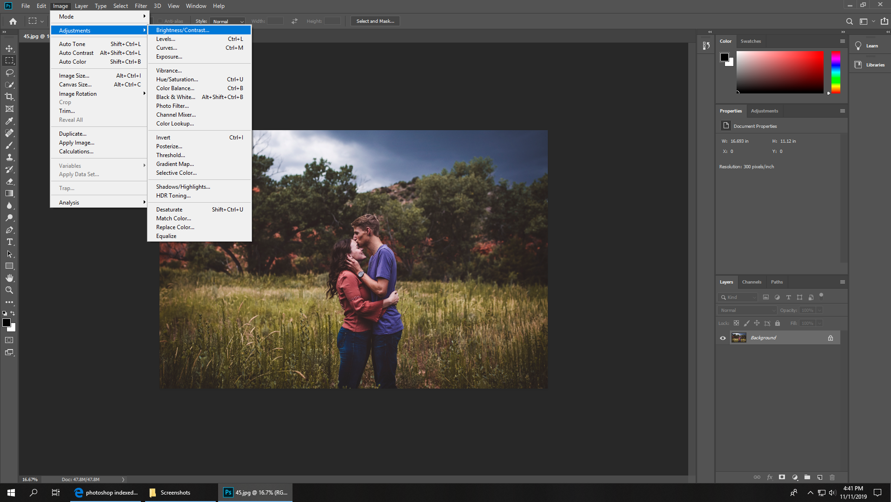

Preparing Images for running on the Laser Engraver
======

This is a guide for taking a picture in full color (Such as from a camera, or an arbitrary image from the internet) and preparing it for use on the laser cutter.

This guide will cover three main methods for preparing images using Photoshop, which is installed by default on all Hub computers. If you can't use Photoshop, [GIMP](https://www.gimp.org/) is a free, open-source alternative. The methods this guide will cover are:

..*Dithering by way of changing modes to Indexed
..*Using the Threshold tool to convert to only black and white.
..*Using the edge-detection filter to get outlines, then using Threshold

The three each have their own advantages and disadvantages. The first one (Dithering) can effectively generate a fading effect more effectively than the laser's built-in software, but requires a lot of trial-and-error for figuring out the right power. The second (Thresholding) can easily generate a very clean engraving with minimal effort. The third (Edge-detection) is good for detailed pictures where the first two don't show all the details.

The examples given in this guide are done using this image as its base:

This image is included in this repo as "baseImage.jpg". If you want to follow along for whatever reason, download it above and click and drag it into Photoshop.

Dithering
------
The first step is to crank the contrast (and brightness, if you want). Like, really crank it. Hard.

